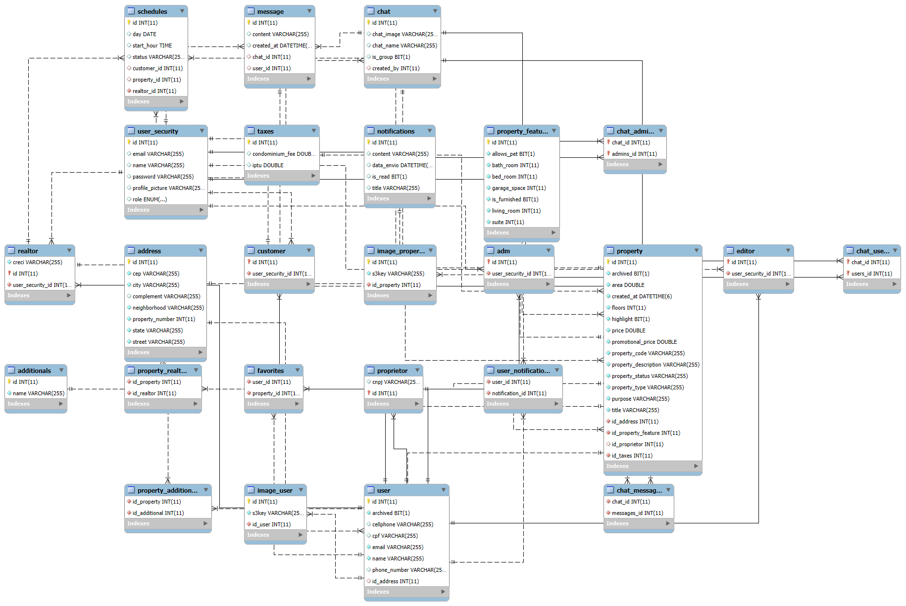

# HAV Imobiliária

## Estrutura do Projeto

### Introdução

Este projeto visa desenvolver um sistema web completo para a HAV Imobiliária, facilitando a gestão de imóveis e a comunicação entre a imobiliária e seus clientes. O objetivo é resolver dificuldades atuais de gerenciamento de imóveis, atendimento ao cliente e comunicação, criando uma plataforma eficiente e intuitiva que melhore a experiência do usuário e otimize os processos internos da imobiliária.

---

## Objetivo Principal

**Desenvolver uma plataforma integrada que:**

- **Automatize processos** como cadastro de imóveis, agendamento de visitas e transações.
- **Melhore a experiência do cliente** com interfaces intuitivas e funcionalidades de autoatendimento.
- **Forneça insights estratégicos** através de análises de dados e relatórios gerenciais.
- **Otimize a comunicação** entre corretores e clientes com ferramentas integradas.

## Tecnologias Utilizadas

As seguintes tecnologias foram utilizadas no desenvolvimento deste projeto:


## Arquitetura e Organização do Projeto
O sistema foi desenvolvido seguindo o padrão MVC (Model - View - Controller) com camadas bem definidas e separação de responsabilidades. A estrutura do back-end em Java + Spring Boot foi organizada em pastas específicas, conforme descrito abaixo:

### Estrutura de Pastas
| Pasta        | Responsabilidade                                                                                       |
|--------------|--------------------------------------------------------------------------------------------------------|
| `Configuration` | Contém as configurações gerais da aplicação, como beans, CORS, Swagger, e outras definições globais. |
| `Controller`    | Camada responsável por receber as requisições HTTP, validar entradas básicas e delegar ações para os serviços. |
| `Exceptions`    | Trata exceções customizadas e handlers globais para capturar erros de forma estruturada. |
| `Matcher`       | Componentes responsáveis por lógica de correspondência entre entidades (ex: algoritmos de match entre usuários e imóveis). |
| `Model`         | Contém as classes de domínio (entidades) que representam as tabelas do banco de dados e os objetos manipulados pela lógica de negócio. |
| `Repository`    | Camada de acesso ao banco de dados usando Spring Data JPA (interfaces `JpaRepository`). |
| `Security`      | Configurações de segurança, incluindo JWT, filtros de autenticação/autorização e Spring Security. |
| `Service`       | Camada onde está concentrada a lógica de negócio da aplicação, validações mais profundas e controle do fluxo de dados entre as camadas. |
| `WebSocket`     | Implementações de comunicação em tempo real usando WebSockets, como notificações ou atualizações ao vivo. |

### Fluxo da Arquitetura

1. O usuário interage com o **Front-End** (Next.js + TypeScript).
2. As requisições são enviadas para os **Controllers** via endpoints REST.
3. Os **Controllers** delegam as ações para as classes de **Service**.
4. Os **Services** tratam as regras de negócio e se comunicam com os **Repositories** para acessar o banco de dados.
5. As entidades manipuladas são definidas em `Model`.
6. A camada de **Security** protege as rotas com autenticação JWT.
7. **WebSockets** permitem notificações em tempo real para o usuário.
8. Imagens são armazenadas na **Amazon S3**, e localizações exibidas com a **Google Maps API**.

## Tecnologias e APIs Externas

As seguintes tecnologias e APIs externas foram utilizadas no desenvolvimento deste projeto:

- **Google Maps API**  
  Utilizada para exibir os imóveis localizados em um mapa interativo no front-end.

- **Amazon S3**  
  Armazenamento de imagens dos imóveis com acesso via URL pública.

- **Spring Security + JWT**  
   Proteção das rotas com autenticação baseada em token.

- **WebSocket**  
  Permite comunicação em tempo real, como atualizações de status ou alertas.


## Banco de Dados / Diagrama de Classe

O diagrama de classes do banco de dados representa a estrutura das entidades que compõem o sistema e como elas se relacionam. Ele foi desenvolvido para mapear as tabelas do banco de dados de forma clara e compreensível, facilitando a gestão das informações e a interação entre as diferentes partes do sistema.




# Instalação

## Guia de Instalação e Uso do Front-end

### Pré-requisitos

Antes de começar, verifique se você tem as seguintes ferramentas instaladas:

- [Node.js](https://nodejs.org/)
- [npm](https://www.npmjs.com/)
- [Git](https://git-scm.com/)

### Passo 1: Clonar o Repositório

Primeiro, clone o repositório do projeto em sua máquina local:

```bash
git clone https://github.com/GabrielvMarinho/HAV-FrontEnd.git
cd HAV-FrontEnd
```


### Passo 2: Instalar as Dependências

Instale as dependências usando seu gerenciador de pacotes favorito:

```bash
npm install
# or
yarn install
# or
pnpm install
# or
bun install
```

### Passo 3: Executar a Aplicação

Inicie o servidor de desenvolvimento com:
```bash
npm run dev
# or
yarn dev
# or
pnpm dev
# or
bun dev
```

A aplicação estará disponível em:

```bash
http://localhost:3000
```

### Observações
- Esse projeto depende do back-end para algumas funcionalidades, como autenticação, listagem de imóveis, etc.

- Certifique-se de que o servidor do back-end também esteja em execução para o front-end funcionar corretamente.

## Guia de Instalação e Uso do Back-end

### Pré-requisitos

Antes de começar, verifique se você tem as seguintes ferramentas instaladas:

- [Java 22](https://www.oracle.com/java/technologies/javase/jdk22-archive-downloads.html)
- [Maven](https://maven.apache.org/)
- [Git](https://git-scm.com/)

### Passo 1: Clonar o Repositório

Clone o repositório do back-end:

```bash
git clone https://github.com/biancavaz/Hav-BackEnd.git
cd Hav-BackEnd
```

### Passo 2: Executar a Aplicação
Abra o projeto em uma IDE compatível com Spring Boot, como o IntelliJ IDEA ou Eclipse.

Basta localizar a classe principal:
```bash
HavImobiliariaApplication
```
e clicar no botão Run (▶️) para iniciar a aplicação.

### Passo 3: Endpoints da API
Depois de iniciada, a aplicação estará disponível em:
```Bash
http://localhost:9090
```

## Organização de Pacotes

O projeto deverá seguir a estrutura abaixo, sem variações:

```
src
└── main
    └── java
        └── com.hav.hav_imobiliaria
             ├── Configuration
             ├── controller
             ├── Exceptions
             ├── matcher
             ├── model
             ├── repository
             ├── security
             ├── service
             └── WebSocket
```

## Contribuição

Desenvolvido por:
- [Gabriel Volles Marinho](https://github.com/GabrielvMarinho)
- [Bianca Vaz](https://github.com/biancavaz)
- [Rafael Henrique da Rosa](https://github.com/RafaelHR12)
- [Eduardo Vizoni do Prado](https://github.com/EduardoVizoni)
- [Nathan João Lima](https://github.com/nathanjoao)
---


